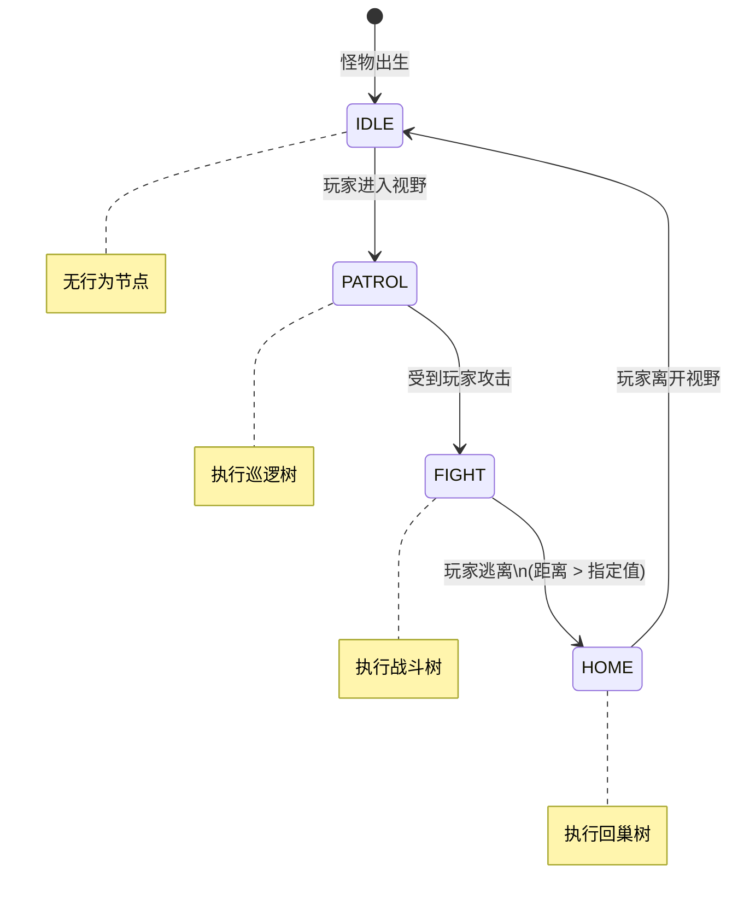
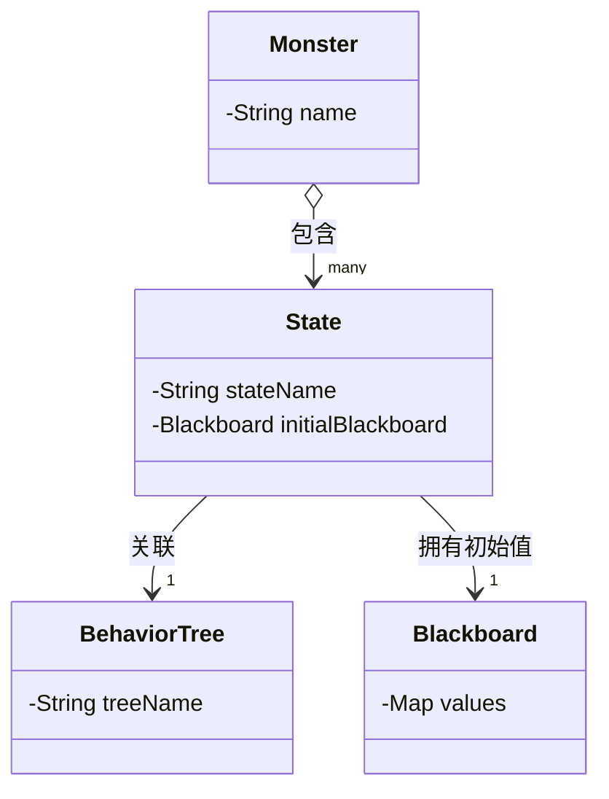

## 行为树概念

行为树是一种控制游戏角色行为的树形结构, 其工作方式为: 由根节点出发, 由上到下, 由左至右, 通过一系列决策节点到达相应的叶子节点, 由叶子节点驱动游戏角色执行相应的行为. 

树包含三种类型节点: 

- 组合节点(Composite): 用于控制运行流, 包含多个子节点

- 装饰节点(Decorator): 用于控制单树枝上的运行流, 包含一个子节点

- 动作节点(Action): 用于实际执行动作, 为叶节点

每个节点可以配置参数读取, 每个节点执行完都会返回 success 或 fail 两种执行结果


接下来详细介绍三种类型节点:

### 组合节点(Composite)

组合节点用于控制行为树的运行流, 通过一系列规则来执行子节点并根据子节点的执行结果来组合返回执行结果. 常见的组合节点包含: 顺序节点(Sequence), 选择节点(Selector), 并行节点(Parallel)

##### 顺序节点(Sequence)

由左到右依次执行子节点, 所有节点执行成功则返回成功, 若出现执行失败的子节点则直接返回失败, 剩余子节点则被"短路". 子节点的关系相当于"与"的关系.


##### 选择节点(Selector)

由左到右依次执行子节点, 当遇到第一个执行成功的子节点则直接返回成功, 剩余子节点则被"短路", 若所有子节点执行失败则返回失败. 子节点的关系相对于"或"的关系.


##### 并行节点(Parallel)

并行执行所有子节点, 可通过配置参数来控制结果的复合. 例如当配置"any"时, 则遇到第一个执行成功的子节点时则返回成功, 配置"all"时, 则需要等待所有子节点返回成功才能返回成功.


以上是三种最基础的复合节点, 此外还可以在这三种节点基础之上添加一些自定义的控制功能, 例如:

##### 随机顺序节点

随机挑选一个子节点执行, 失败则返回失败, 成功则随机另一个子节点, 重复该流程, 直到全部执行完毕, 返回成功.

##### 随机选择节点

随机挑选一个子节点执行, 成功则返回, 失败则随机另一个子节点, 重复该流程, 直到全部执行失败, 返回失败.

### 装饰节点(Decorator)

装饰节点用于控制单树枝上的运行流, 常见的控制包括: 重复执行子节点, 修饰子节点的返回结果, 控制子节点是否可以执行

其中, 用于控制子节点的是否可以执行的节点作为装饰节点的一类特殊节点, 统称为条件节点(Condition)

多个装饰节点可以嵌套, 例如可以在一个节点上叠加多个条件节点来实现多条件判断:


下面举例几种常见节点:

##### 重复执行(Repeat)

重复执行子节点, 需要配置参数successCount, failCount, totalCount, 当子节点的执行结果次数达到指定的次数时返回成功或失败

##### 延迟执行(Delay)

在子节点执行前延迟指定时间, 需要配置参数delay

##### 必定成功(Success)

不管子节点返回什么结果, 都返回成功

##### 必定成功(Fail)

不管子节点返回什么结果, 都返回失败

##### 逆反节点(Inverse)

对子节点的返回结果取逆

#### 条件节点(Condition)

条件节点在子节点执行前先判断给定条件是否成立, 条件判断成功则执行子节点并返回子节点的执行结果, 判断失败则直接返回失败.

条件节点固定存在三个参数:suspend, interrupt, inverse

**suspend**: 当开启时, 若条件判断为true, 则直接执行子节点, 若条件判断为false, 则挂起, 并持续监听状态变化事件, 当接受到中断信号时, 返回失败. 当状态改变时若条件判断为true, 则继续执行子节点.

**interrupt**: 当开启时, 若子节点存在组合节点或持续性动作节点(Continuous), 则持续监听状态变化事件, 当状态改变时若条件判断为false, 则向所有子节点发出中断信号

**inverse**: 对条件判断结果取反

### 动作节点(Action)

动作节点可以使游戏角色执行具体的动作, 例如:移动, 攻击, 播放动画, 修改怪物属性等等. 

其中可以细分为两种类型: 瞬时动作节点和持续性动作节点(Continuous)

瞬时动作节点顾名思义其运行时间为瞬时, 几乎忽略不计, 不受到父节点打断信号的影响, 常用于修改属性

持续性动作节点顾名思义会执行一段时间, 这段时间可以受到父节点的打断信号,当收到打断信号时, 会执行相应的打断方法. 例如在移动节点收到打断时, 会立即终止移动计时器, 计算当前坐标, 向客户端推送中止移动消息.

## 行为树的驱动方式

传统行为树采用tick-driven驱动, 即按照设定的频率, 每间隔一段时间, 向行为树发出信号. 由于不保存上次执行的状态, 所以行为树每次接收到信号后, 都需要从根节点出发向下执行. 这样的坏处显而易见: 怪物大部分时间都保持在同一个状态, 每次的执行路径往往相同, 出现大量的无效判断, 造成cpu资源浪费.

在本项目中使用了event-driven驱动行为树, 即事件驱动. 这体现在几个方面:

1. 行为树的运行有了状态

2. 行为树的启停/中断通过接收实体收到的事件来进行控制

3. 装饰节点可以在子节点运行时持续监听状态改变事件, 当接收到状态改变事件后可以中断运行中的子节点

例如, 若行为树配置了一个距离判断节点, 在帧驱动行为树中, 会一直轮询判断实体与目标的距离. 而在事件驱动行为树中, 会在实体上监听位置改变事件, 当接受到事件时, 才会去判断条件是否成立, 这样大大减少了性能的无谓消耗

## 行为树的中断

行为树的中断体现在两个方面: 行为树内部条件中断及行为树外部中断

### 行为树内部条件中断

行为树内部条件中断是指行为树内部条件节点判断变化时发生的中断, 通常发生在实体属性改变时且行为树内部有条件节点正在监听该属性的改变事件.

以下图举例, 假设一个怪向一个目标发动攻击, 在距离不够的时候需要向目标移动. 在向目标移动过程中, "是否大于攻击距离"会监听实体移动的事件, 当接收到实体移动事件且判断条件失败时会打断子节点, 然后经过"必定成功"返回 success 到"顺序执行"节点, 最后执行"释放技能"节点


条件中断主要用于响应行为树内部和外部的属性变化. 当一棵树有多个条件节点注册了同一事件时, 应按照由上至下, 由左至右的顺序进行打断.

### 行为树外部中断

行为树外部中断用于响应行为树之外的动作.

例如, 玩家有一项使怪物原地表演的技能, 当怪物在移动节点的运行过程中, 被玩家攻击后停止移动开始原地表演. 如果通过行为树内部响应实现的话, 由于动作的优先级较高且需要全局监听, 就要在根节点配置条件节点来持续检测技能受击. 当出现新的动作需求时, 要继续在根节点添加条件检测节点, 这样根节点的条件检测臃肿不堪, 而且已经配置好行为树的怪物为了响应新动作需要再次修改树结构. 

为了解决这个问题, 我们可以将行为树的外部动作提出来作为单独的响应通道. 回到之前的案例中, 当行为树在移动节点时遇到了表演打断, 首先先向行为树发出中断信号, 并暂停运行流, 然后向客户端推送表演消息来及时响应动作. 当表演结束以后, 再恢复运行行为树.

此时又带来了新的问题, 若在怪物表演期间来了新的打断, 例如击飞, 该如何响应呢?

我们可以预先给怪物的打断动作设置一个优先级, 当新的动作优先级大于等于当前动作的优先级时, 则由新的动作打断当前动作.

当打断动作执行结束以后, 有两种恢复方式:

1. 恢复到被打断前的节点, 继续执行

2. 从根节点重新开始执行

通常情况下, 被外部打断后, 会触发顶层条件判断变化, 即使回到了被外部打断前运行的节点, 也会被顶层的条件节点内部打断. 所以为了简化开发, 我们选择了第二种方案. 但是第二种方案也有缺点, 若策划配置的行为树比较死板, 会导致怪物每次被外部打断后机械地执行同一套动作. 为了解决这个问题, 一方面需要策划可以根据当前的状态精细地调整行为树, 另一方面应想办法避免完全回到根节点, 可以采取某种方案回到最近的战斗节点, 具体可以看下文行为树与状态机的结合.

## 行为树与状态机

虽然对于单个怪物的复杂行为, 行为树可以作为状态机的有效替代. 但是状态机相对于行为树也有一些不可替代的优势:

1. 状态机可以简化一些简单逻辑的实体

2. 在大部分情况下, 怪物处于脱战状态, 状态机可以简化行为树的复杂判断, 性能更好

3. 在群体AI中, 状态机可以通过修改多个怪物状态的方式来实现怪物分组, 进而高效地管理怪物组的行为.

基于行为树和状态机的优势, 可以在行为树的上层再设置一层状态机, 每个状态有一个事件监听表和一套独立的行为树. 当接收到指定事件时, 迁移到对应状态, 并运行状态内的行为树.

例如, 现在有一个怪物在玩家没有进入视野时暂停运行, 在玩家进入视野时开始巡逻, 在玩家攻击时开始战斗, 在玩家逃离时开始回巢. 我们可以配置IDLE, PATROL, FIGHT, HOME四个状态. 在怪物出生时处于IDLE状态, 状态内没有任何节点, 当接收到PATROL所监听的玩家进入视野事件时, 切换并执行巡逻树, 当接收到FIGHT所监听的受击事件时切换并执行战斗树, 接收到HOME所监听的实体坐标变化事件时需要判断自己与敌对实体的位置, 若大于指定距离则切换并执行回巢树, 直到玩家离开视野又回到IDLE状态.



这样同时也解决了上文中提到的暂停恢复行为树后从根节点出发出现的固定节点切换问题.

另外在群体AI中, 这个设计还带来了额外的好处, 实体控制器可以动态地将多个怪设置不同的状态来对怪物进行分组, 例如在多个怪物与玩家战斗时, 可以将部分怪设置成战斗状态与玩家战斗, 部分怪设置成奶妈状态为其他怪回血, 部分怪设置成警戒状态在战斗外围与玩家对峙. 这样既避免了怪物一窝蜂的冲向玩家, 提升了玩家体验, 其次避免了大量的怪物同时运行复杂的战斗任务, 优化了性能.

## 行为树实现

在实现行为树前, 我们先通过实际场景来确定配置的形式和之间的关系

场景1: 游戏场景内有多个怪物共享一套行为树, 有些怪物相对于其他怪物在某些节点的参数不同

场景2: 有些BOSS的行为可以分成多个阶段, 每个阶段都能展开一颗庞大的树, 而策划的工作流是由多个战斗小组并行开发多个阶段行为

根据以上两个场景, 我们可以确定配置的形式:



其中, 怪物的配置不直接关联行为树, 而是通过多个状态来组合. 每个状态对应一个行为树, 行为树内的节点使用的参数最好不要在节点内直接写死, 而是尽量引用在状态内的初始黑板值. 这样提高了行为树的复用率.

另外, 在早期还使用过"子树"的动作节点来解决行为树的复用问题, 该动作节点的参数为子树的树名, 在构造时会读取子树数据, 以父树的子树节点作为子树的根节点, 展平到父树上.

行为树的配置可以通过图形化的配置生成器生成, 并导出yaml或json格式, 然后由服务器进行读取解析. 配置生成器可以保存一些预设模板来加速配置.

行为树在内存中仅保留一份实例, 在初始化怪物时, 怪物身上会挂一个行为树组件, 其中包含了怪物的状态机, 状态机对于行为树的引用和怪物自己的黑板map. 在运行时, 通过给节点传入行为树组件的方式来修改怪物身上行为树的状态.

```java
public class Attack extends BTNode.Action {
    private final String skill;

    public Attack(BehaviorTree tree, JSONObject params) {
        super(tree);
        this.skill = params.getString("skill");
    }

    @Override
    protected boolean logic(BTComponent component) throws Exception {
        // 若参数引用了黑板值, 则从黑板系统获取, 否则直接读取
        String skill = this.skill.startsWith("&")
                ? (String) component.getBBEntry(this.skill.substring(1))
                : this.skill;
        // 模拟调用战斗系统
        System.out.println(component.host + "attacking with skill" + skill);
        Thread.sleep(3000L);
        return true;
    }
}
```
